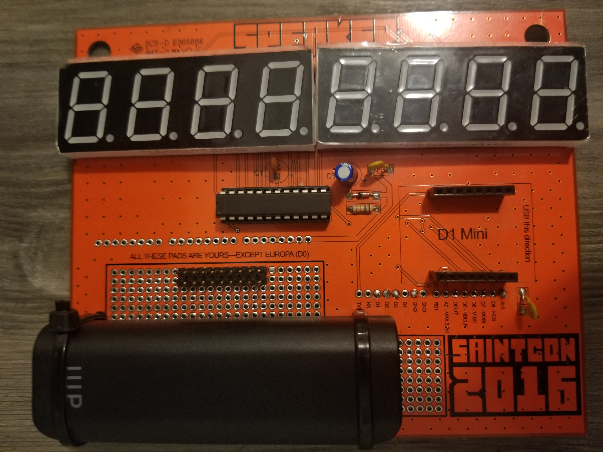

# Saintcon 2016 Badge Minibadge Backport

This project backports support for minibadges to the
Saintcon 2016 Badge.  It does not integrate it into the 2016 badge code
but instead replaces the code entirely.

The 2016 badge uses a Wemos d1 miniboard and the code is written for the
arduino platform.

In the code you can change the DEFAULT_MESSAGE and DEFAULT_MESSAGE_SIZE
to display your own custom message on the LED display.  This message will
appear anytime there are no messages from the minibadges.  It will also
display once everytime through the cycle of minibadge messages.

You will need to install the LedControl library
(https://github.com/wayoda/LedControl). I recommend editing the library to
support a larger set of display characters.  Here is the list I use.

```
/*
 * Segments to be switched on for characters and digits on
 * 7-Segment Displays
 */
const static byte charTable [] PROGMEM  = {
  B01111110,B00110000,B01101101,B01111001,  B00110011,B01011011,B01011111,B01110000, //  (0) 0123 4567
  B01111111,B01111011,B01110111,B00011111,  B00001101,B00111101,B01001111,B01000111, //  (8) 89AB CDEF
  B01100000,B00011000,B00001100,B01000010,  B01101100,B01011010,B00110001,B00000111, // (16) •••• ••••
  B01000000,B01001000,B01001001,B00000000,  B00000000,B00000000,B00000000,B00000000, // (24) •••• ••••
  B00000000,B00000000,B00100010,B00000000,  B00000000,B00000000,B00000000,B00100000, // (32)  ×"× ×××'
  B01001110,B01111000,B01100011,B00000000,  B10000000,B00000001,B10000000,B00100100, // (40) ()*× ,-./
  B01111110,B00110000,B01101101,B01111001,  B00110011,B01011011,B01011111,B01110000, // (48) 0123 4567
  B01111111,B01111011,B00001001,B00001001,  B01000011,B01000001,B01100001,B11110010, // (56) 89:; <=>?
  B01110111,B01110111,B01111111,B01001110,  B00111101,B01001111,B01000111,B01011110, // (64) @ABC DEFG
  B00110111,B00000110,B00111100,B01010111,  B00001110,B01101010,B01110110,B01111110, // (72) HIJK LMNO
  B01100111,B01110011,B00000101,B01011011,  B01110000,B00111110,B00111110,B01011100, // (80) PqrS TUVW
  B01001001,B00111011,B01101101,B01001110,  B00010010,B01111000,B01100010,B00001000, // (88) XYZ[ \]^_
  B00000010,B01110111,B00011111,B00001101,  B00111101,B01001111,B01000111,B01011110, // (96) `Abc dEFG
  B00010111,B00010000,B00111100,B01010111,  B00110000,B01101010,B00010101,B00011101, //(104) hiJK lMno
  B01100111,B01110011,B00000101,B01011011,  B00001111,B00011100,B00011100,B01011100, //(112) PqrS tuvW
  B01001001,B00111011,B01101101,B01001111,  B00000110,B01111001,B00100101,B00000000  //(120) XYZ{ |}~×
};
```

## Wiring guide

ExtenderHeader to Wemos D1 Mini
 - SCL to D1
 - SDA to D2
 - CLK to D3*
 - GND to GND
 - 5v to 5v
 - 3v3 t0 3v3

*Powering the CLK pin from D3 (or any other GPIO pin) results in a
power-restriced CLK. I.e. you will not be able to power more than a
few minibadges using the CLK.  An alternative solution is to wire up
a pair of MOSFETs or an H-bridge.  I have not yet done this so some
code changes are likely needed to make this work.

## Wiring example




